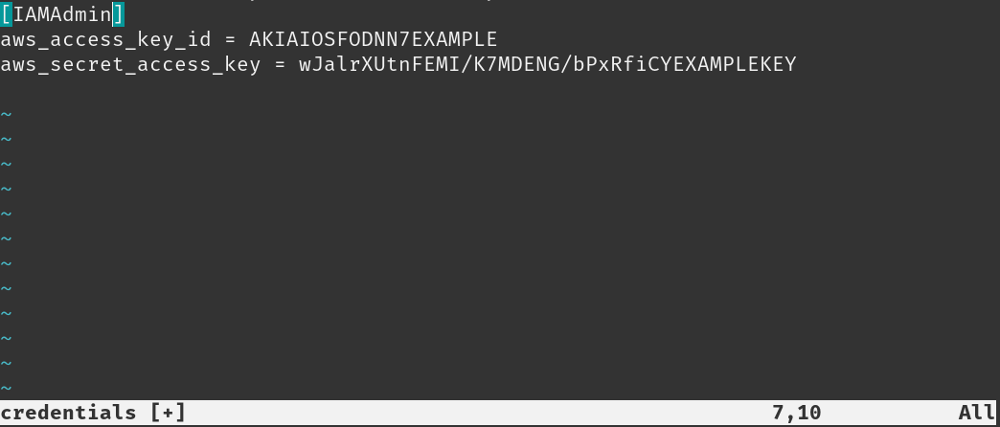

# Web-app.v1-Devops

## Example of profile: Using AWS CLI

### Method 1: Configure with wizard
```sh
aws configure
```
### Method 2: Configure specific profile

```sh
aws configure --profile profile_name
```
### Method 3: Set credentials manually

```sh
aws configure set aws_access_key_id "your_access_key"
aws configure set aws_secret_access_key "your_secret_key"
aws configure set region "us-east-1"
```
The configured file can be found in:



```sh
/home/{username}/.aws/credentials
```
Alternatively, you can manually cd to 
```sh
/home/{username}/.aws/credentials
``` 
and edit out the credential file to manually set a profile, [work,personal,etc..]


